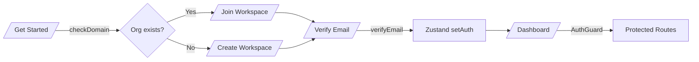

# Gaprio Frontend Implementation Audit

> **Scope note:** The repository does **not** contain a `/frontend` directory. This document is based on the actual Next.js app located at the repository root (`/app`, `/components`, `/api`, `/store`, `/public`).

## 1. Current Frontend Overview

**What the frontend currently does**
- Provides a marketing landing page with animated hero, problem sections, and integration showcase.
- Offers waitlist signup with backend submission.
- Implements a multi‑step authentication flow (get started → create/join workspace → verify email → login).
- Provides a protected dashboard shell with an overview tab and a Google Workspace module.
- Supports action notifications via a service worker + monitoring endpoints.

**Main implemented features**
- Landing page and marketing sections (Hero, Problem/Platforms, Integration diagram).
- Waitlist form submission.
- Auth flows with OTP verification and token storage.
- Protected dashboard with overview cards and Google Workspace operations (email, calendar, drive) via API.

**Existing pages/modules**
- `/` Home landing
- `/waitlist`
- `/login`
- `/get-started`
- `/create-workspace`
- `/join-workspace`
- `/verify-email`
- `/dashboard` (protected)

**Tech stack actually used**
- **Next.js 16 (App Router)** + **React 19**
- **Tailwind CSS v4** (via `@tailwindcss/postcss`)
- **Zustand** for auth/session state
- **Axios** for API calls (custom `apiClient` with refresh queue)
- **GSAP** for auth/waitlist animations
- **Framer Motion** for landing and UI transitions
- **react-hot-toast** + **sonner** for notifications
- **Lucide** icons

**UI architecture summary**
- App Router pages compose **global**, **landing**, and **dashboard2** component sets.
- **AuthGuard** wraps the entire app and gates navigation based on Zustand auth state.
- Dashboard uses a sidebar + main content region with tab switching controlled in state.

---

## 2. Implemented Features Documentation

### Status legend
- **Fully implemented**: end-to-end UI + API integration wired.
- **Partially implemented**: UI exists, but backend integration or routing is incomplete.
- **UI-only / incomplete**: UI exists but unused, un-routed, or depends on missing utilities.

| Feature | Status | What it does | Key pages/components | API connections | State management |
| --- | --- | --- | --- | --- | --- |
| Marketing landing | Fully implemented | Hero + problem statements + integration visualizations | `app/page.js`, `components/landing/*`, `components/global/Navbar` | None | Local component state only |
| Waitlist signup | Fully implemented | Collects name/email/role/use case and submits to backend | `app/waitlist/page.jsx` | `waitlistApi.joinWaitlist` → `/waitlist/join` | Local component state |
| Get Started (domain check) | Fully implemented | Checks if workspace exists for email domain and routes to join/create | `app/(auth)/get-started/page.jsx` | `authApi.checkDomain` → `/auth/check-domain` | Local component state |
| Create workspace (admin) | Fully implemented | Registers admin + org and redirects to email verification | `app/(auth)/create-workspace/page.jsx` | `authApi.registerAdmin` → `/auth/register/admin` | Local component state + Zustand setAuth (after verification) |
| Join workspace (member) | Fully implemented | Registers member and redirects to email verification | `app/(auth)/join-workspace/page.jsx` | `authApi.registerMember` → `/auth/register/member` | Local component state |
| Verify email (OTP) | Fully implemented | Verifies code, sets auth tokens, redirects to dashboard | `app/(auth)/verify-email/page.jsx` | `authApi.verifyEmail`, `authApi.resendVerification` | Zustand `setAuth` |
| Login | Fully implemented | Authenticates user, stores tokens, redirects to dashboard | `app/(auth)/login/page.jsx` | `authApi.login` → `/auth/login` | Zustand `setAuth` |
| Auth guard + session persistence | Fully implemented | Protects routes, redirects based on auth, rehydrates from localStorage | `components/global/AuthGuard.jsx`, `store/useAuthStore.js` | `apiClient` refresh flow | Zustand + localStorage |
| Dashboard overview | Partially implemented | Shows greeting + identity/workspace cards; org data not fetched in dashboard page | `app/(protected)/dashboard/page.jsx`, `components/dashboard2/Greeting`, `InfoCards` | None in overview tab | Zustand user/org (org may be null) |
| Google Workspace module (dashboard2) | Partially implemented | Connect/disconnect, inbox, calendar, drive, compose/reply, upload | `components/dashboard2/GoogleWorkspace.jsx` | `googleServiceApi.*`, `integrationsApi.getProviderData` | Local state + props |
| Action notifications (dashboard2) | Partially implemented | Polls `/monitoring/actions` and shows popup; uses SW for background polling | `components/dashboard2/ActionPopupNotification.jsx`, `public/sw-notifications.js` | `apiClient.get('/monitoring/...')` | Local state + service worker |
| Sidebar integrations list | UI-only/incomplete | Shows integrations and “Coming soon” toasts for most | `components/dashboard2/Sidebar.jsx` | None for unimplemented providers | Local state |
| Legacy dashboard modules (dashboard/) | UI-only/incomplete | Old dashboard UI for Slack/Asana/Jira/Miro/Zoho/etc. Not routed; references missing `@/lib/axios` | `components/dashboard/*` | Various (auth/integrations paths) | Local state only |

**Notes on partial/legacy modules**
- The `/components/dashboard` folder appears to be an older dashboard implementation and is **not referenced** by current routes.
- Several legacy modules import `@/lib/axios`, but no `lib/axios` exists in the repo (broken import).

---

## 3. Existing Pages & Routes

| Route | Purpose | Key components | API calls | Auth required | Main functionality |
| --- | --- | --- | --- | --- | --- |
| `/` | Marketing landing | `Navbar`, `Hero`, `Platforms`, `IntegrationGrid` | None | No | Marketing content + CTAs |
| `/waitlist` | Early access request | Waitlist page component | `waitlistApi.joinWaitlist` | No | Submit waitlist form |
| `/login` | Login | Auth form | `authApi.login` | No | Authenticate user |
| `/get-started` | Entry flow | Email check | `authApi.checkDomain` | No | Decide join vs create |
| `/create-workspace` | Admin registration | Admin setup form | `authApi.registerAdmin` | No | Create org + admin |
| `/join-workspace` | Member registration | Member setup form | `authApi.registerMember` | No | Join existing org |
| `/verify-email` | OTP verification | OTP inputs + resend | `authApi.verifyEmail`, `authApi.resendVerification` | No | Verify account, set tokens |
| `/dashboard` | Main app (protected) | `Sidebar`, `DashboardHeader`, `Greeting`, `InfoCards`, `GoogleWorkspace`, `ActionPopupNotification` | `integrationsApi.getProviderData`, `googleServiceApi.*`, `/monitoring/*` | Yes | Dashboard + Google Workspace + action popups |

**Routes referenced but NOT implemented**
- Navbar links: `/features`, `/integrations`, `/pricing`, `/enterprise`, `/register`
- Landing CTA: `/demo`

---

## 4. Components Documentation (Reusable & Key Modules)

### Global
| Component | Purpose | Key props | Notes |
| --- | --- | --- | --- |
| `Navbar` | Fixed marketing navigation | None | Includes mobile menu; links to unimplemented routes |
| `AuthGuard` | Protects routes based on auth | `children` | Redirects to `/login` or `/dashboard` based on auth state |
| `Footer` | Footer UI | None | Present but not used in routing |

### Landing
| Component | Purpose | Key props | Notes |
| --- | --- | --- | --- |
| `Hero` | Hero section + CTAs | None | Framer Motion animations; CTA to `/waitlist` and `/demo` |
| `Platforms` | Problem/stack cards | None | Responsive interactive card system |
| `IntegrationGrid` | Integration diagram | None | Animated connection map of tools |

### Dashboard (current: `dashboard2`)
| Component | Purpose | Key props | State/UI behavior |
| --- | --- | --- | --- |
| `Sidebar` | Navigation + integrations | `activeTab`, `setActiveTab`, `user`, `pendingCount`, etc. | Shows “Coming soon” toasts; uses `next/font` for Saira |
| `DashboardHeader` | Top bar + logout | None | Calls `authApi.logout`, clears store |
| `Greeting` | Welcome headline | `user` | Simple display only |
| `InfoCards` | Identity/workspace/action cards | `user`, `org` | Workspace card shows “Fetching…” when org null |
| `GoogleWorkspace` | Google inbox/calendar/drive | `isConnected`, `data`, `user`, `onRefresh` | Modals, compose, reply, upload, delete |
| `ActionPopupNotification` | Action suggestions | `onCountChange` | Uses service worker + polling |

### Legacy dashboard (not routed)
- `AiAssistant`, `SlackWorkspace`, `AsanaWorkspace`, `JiraWorkspace`, `MiroWorkspace`, `ZohoWorkspace`, `MonitorSettings`, etc.
- These appear feature-rich but **are not wired to any route** and rely on a missing `@/lib/axios` import.

---

## 5. Current State Management

**Zustand store (`store/useAuthStore.js`)**
- Persisted via `localStorage` under `gaprio-auth-storage`.
- Stores `user`, `org`, `accessToken`, `refreshToken`, `isAuthenticated`, `isHydrated`.
- `setAuth`, `refreshTokens`, `logout`, `updateUser`, `updateOrg` actions.

**API state handling**
- `apiClient` adds access token to headers and handles refresh with a queue to prevent parallel refreshes.
- No React Query usage (dependency exists but unused).

---

## 6. Current Authentication Flow

**Implemented flow**
1. User enters email on `/get-started`.
2. Backend check determines if org exists → redirects to `/join-workspace` or `/create-workspace`.
3. User completes registration → `/verify-email`.
4. OTP verification sets tokens in Zustand → redirect to `/dashboard`.
5. `AuthGuard` redirects public vs protected routes based on `isAuthenticated`.

**Token/session handling**
- `accessToken` and `refreshToken` stored in Zustand + localStorage.
- `apiClient` refresh interceptor requests `/auth/refresh` and updates store.
- Logout clears tokens and redirects to `/login`.



---

## 7. Styling & UI System

**Styling**
- Tailwind CSS v4 with `@theme` token definitions in `app/globals.css`.
- CSS variables define background/surface, typography, primary accent, border colors.
- Custom utilities: `.glass-morphism`, `.bg-mesh`, `.hero-grid`, `.glow-line`.
- Custom scrollbars and selection styles in global CSS.

**Fonts**
- `next/font` Google fonts: Geist, Geist Mono (in root layout) and Saira (dashboard sidebar).

**Animations**
- GSAP + `@gsap/react` for auth and waitlist pages.
- Framer Motion for landing, nav, and dashboard transitions.

**Responsive design**
- Tailwind responsive utilities throughout; multiple layouts adapt at `sm/md/lg/xl` breakpoints.

---

## 8. Frontend Architecture Analysis

**Folder structure**
```
/app                Next.js App Router pages
/components         UI components (global, landing, dashboard, dashboard2)
/api                API client wrappers
/store              Zustand store
/public             Static assets + service worker
```

**Routing architecture**
- App Router with route groups: `(auth)` and `(protected)`.
- `AuthGuard` wraps the entire app, not only protected routes.

**Component architecture**
- UI components grouped by domain (`landing`, `dashboard2`, `global`).
- `dashboard` directory is legacy/unrouted.

**Data flow**
- UI → API modules (`authApi`, `integrationsApi`, `googleServiceApi`, `waitlistApi`) → backend.
- Auth state persisted in Zustand with localStorage hydration.
- Service worker polls for monitoring actions in the background.

**Rendering strategy**
- Mostly client components (`'use client'` is used across pages and UI modules).

**Performance approach**
- Basic Next.js optimizations; limited explicit performance features.
- Several components use raw `` elements instead of `next/image` (lint warnings).

---

## 9. Codebase Health Analysis

**Maintainability & structure**
- Clear separation of `landing`, `dashboard2`, and `global` components.
- **Duplicate dashboard implementations** (`dashboard` vs `dashboard2`) increase maintenance cost.

**Scalability**
- Auth and API layers are modular, but most UI is client-only.
- Lack of shared UI primitives (buttons/forms) causes repeated patterns.

**Code smells / issues**
- **Broken imports**: legacy dashboard components reference `@/lib/axios`, which does not exist.
- **Dead routes**: Navbar links point to pages not present.
- **Unused dependencies**: React Query, Three.js stack, Lenis, etc. are not used in code.
- **Inconsistent notification libs**: both `react-hot-toast` and `sonner` are used.

**Accessibility concerns**
- Heavy use of `` without `next/image` and inconsistent alt text.
- Some form inputs rely on placeholder text instead of explicit labels (varies by page).

**Production readiness**
- Auth flow and dashboard UI exist but still depend on backend readiness.
- Build can fail in CI due to external font fetch (observed during build).
- No explicit error boundaries, loading skeletons, or SSR fallbacks beyond Suspense in auth flows.

---

## Appendix: Key Configs

| File | Purpose |
| --- | --- |
| `next.config.mjs` | Default Next.js config (empty) |
| `postcss.config.mjs` | Tailwind v4 PostCSS integration |
| `eslint.config.mjs` | Next.js core web vitals config |
| `app/globals.css` | Tailwind theme tokens + global styles |

